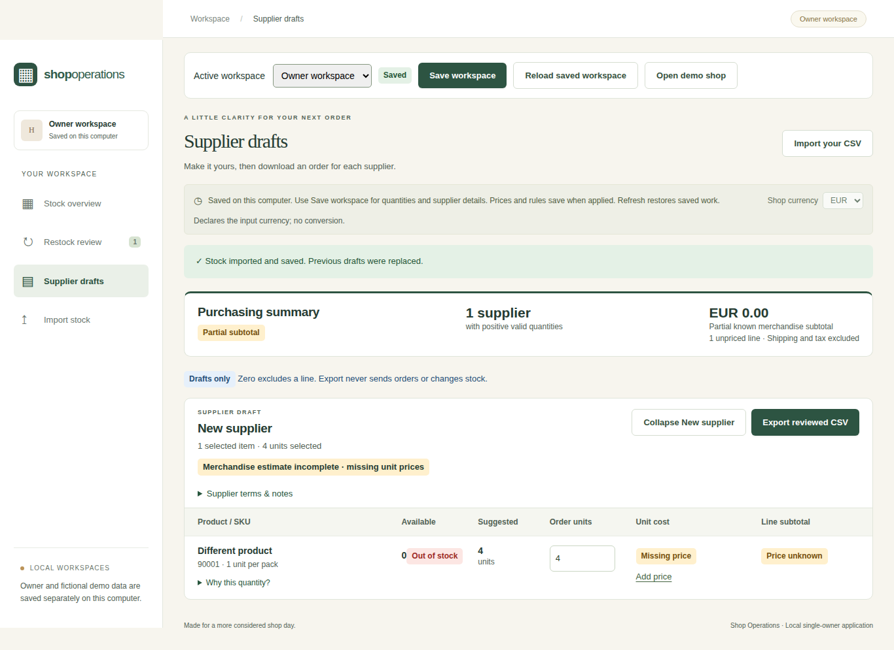

# Shop Operations

A local stock and purchasing workflow that turns CSV inventory into explainable restock reviews and costed supplier drafts.

**Documentation-only portfolio showcase by Farook Fahath.**

## Features

- CSV validation and preview, searchable stock, and low/unknown-stock filtering.
- Restock suggestions using minimum stock, target quantities, and supplier pack sizes.
- Editable prices, supplier terms, draft quantities, and reviewed CSV export.
- Separate SQLite owner and fictional-demo workspaces, explicit saving, stale-save conflict protection, and backup/restore tooling.

## Technology

React, TypeScript, Vite; Python, FastAPI, Pydantic, SQLite; Decimal-based backend monetary calculations.

## Current status

Implemented local, single-owner application with a fictional demo workspace. Unpublished as a hosted application. It has no authentication and is intended for local use.

## Scope and limitations

Exports are drafts for manual review: they do not send orders or change stock. Currency selection does not convert values. No forecasting, payment processing, live synchronization, or production-readiness claim.

## Demo and video

No verified public application demo or video link is available for this showcase.

## Screenshot

Existing desktop capture, visually reviewed before publication. The generic product and supplier were traced to an isolated browser-check fixture; the “Owner workspace” label in this capture does not represent real owner inventory.

## About this repository

Descriptions were checked against current project documentation and implementation. This repository contains curated documentation and a reviewed screenshot; application source, original Git history, and private project links are excluded. No new application builds or tests were run for this portfolio update.

[Back to Farook Fahath’s profile](https://github.com/farookfahath)
